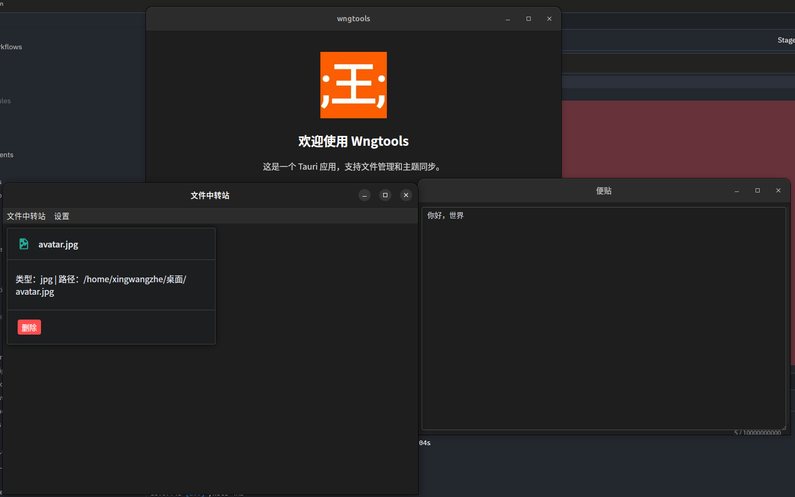

# WngTools

[](https://tauri.app/)
[](https://astro.build/)
[](https://vuejs.org/)
[](https://www.typescriptlang.org/)

<div align="center">


</div>

一个正在开发的现代化的跨平台桌面工具应用，集中于系统托盘，基于 Astro + Vue 3 +
Tauri 构建，提供文件中转等实用功能。


## 🚀 快速开始

建议使用`bun`作为包管理器以获得最佳性能。

### 安装依赖

```bash
# 使用 Bun（推荐）
bun install

```

### 开发模式

```bash
# 启动前端开发服务器
bun run dev

# 或启动完整应用（前端 + Tauri）
bun run tauri dev
```

### 构建应用

```bash
# 构建前端
bun run build

# 构建桌面应用
bun run tauri build
```

## 🛠️ 技术栈

### 前端技术栈

### 开发工具

- **包管理**: Bun - 快速的JavaScript运行时和包管理器
- **代码质量**: Oxc 0.9.0 - 快速的linter
- **格式化**: Prettier 3.3.0 - 代码格式化工具

## 🛠️ 开发工具配置

### 代码质量

项目使用现代化的代码质量工具确保代码质量：

#### Oxc Linter

使用 [Oxc](https://oxc.rs/) 作为快速的 JavaScript/TypeScript linter。

```bash
# 检查代码
bun run lint

# 自动修复
bun run lint:fix
```

#### Prettier

代码格式化工具。

```bash
# 格式化代码
bun run format

# 检查格式化
bun run check
```

### VS Code 配置

推荐安装以下扩展以获得最佳开发体验：

- `oxc.oxc-vscode` - Oxc Linter 支持
- `esbenp.prettier-vscode` - Prettier 格式化
- `astro-build.astro-vscode` - Astro 支持
- `vue.volar` - Vue 3 支持
- `tauri-apps.tauri-vscode` - Tauri 支持

## 🎯 功能介绍

### 系统集成

- 系统托盘图标
- 自启动功能
- 窗口管理

## 🤝 贡献

欢迎提交 Issue 和 Pull Request！

Tauri是个跨平台框架，本项目不介意Mac或者Windows用户的贡献。但希望提交时能有清晰图文描述，因为我没有Mac设备，我也几乎不用Windows，所以在测试上并不方便。

### 开发流程

### 代码规范

- 使用 TypeScript 编写代码
- 遵循 ESLint 和 Prettier 配置
- 提交前运行 `bun run check` 确保代码质量

## 📄 许可证

本项目采用 GPL3 许可证 - 查看 [LICENSE](LICENSE) 文件了解详情。

## 🙋‍♂️ 支持

如果您有任何问题或建议：

- 提交 [GitHub Issue](https://github.com/xingwangzhe/wngtools/issues)

---

**Made with ❤️ using [Astro](https://astro.build/), [Vue](https://vuejs.org/),
and [Tauri](https://tauri.app/)**
